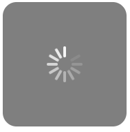
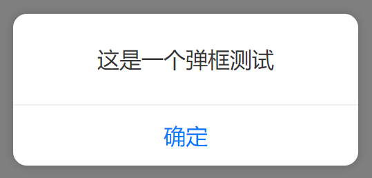

# cl-utils

日常开发常用功能集合，**零CSS依赖**，响应式支持PC和移动端

**TODO** 待实现功能列表

- [ ] 滚动条和滚动条组件
- [ ] 级联选择器


## 安装

```
npm install cl-utils
```

## 全集

```javascript
import {
  ajax,
  is,
  rem,
  Ticker,
  touchHover,
  Activable,
  Clickable,
  Toast,
  Loading,
  Alert,
  Normalize
} from "cl-utils";
```

# Normalize 组件

**适用于移动端**，简单的样式reset以及自适应组件

```typescript
<Normalize designWidth={375} criticalWidth={576}/>
```

默认值：

- 设计尺寸：`375px`
- 临界尺寸：`576px`


# ajax

基于 [`axios`](https://github.com/axios/axios) 进行扩展，除了支持 `axios(config)` 的全部配置，还支持部分扩展参数：

```typescript
interface RequestLoadingOption extends LoadingOption<any> {
  // loading动画最小展示时长，默认1000ms
  minExistTime?: number;
}
interface RequestOption extends AxiosRequestConfig {
  // 是否展示loading动画，可以传递布尔值，也可以传递loading配置参数
  // LoadingOption 的参数选项参考Loading组件，默认: false
  loading?: RequestLoadingOption | boolean;
  // 是否在url参数后添加当前时间，禁用浏览器缓存。默认: false
  disableHttpCache?: boolean;
  // 将当前页面的URL参数透传到所有的Http请求中去
  transmitParam?: boolean;
  // 当当前页面hash的参数透传到所有的http请求中去
  transmitHashParam?: boolean;
}
```

示例：

```javascript
// 1、显示默认loading动画
ajax({
  url: "https://example.com",
  loading: true,
  httpCache: true
})
// 2、配置loading动画
ajax({
  url: "https://example.com",
  loading: {
    minExistTime: 500, // 单位毫秒
    type: "helix" // 菊花loading
  },
  httpCache: true
})
```

# is

基于 [lodash](https://lodash.com/) 进行二次包装盒扩展，用于数据类型，环境等判断：

```typescript
declare const is: {
  anroid(): boolean; 
  ios(): boolean;
  weixin(): boolean;
  QQ(): boolean;
  iphoneX(): boolean;
  touchable(): boolean;
  boolean: (value?: any) => value is boolean;
  element: (value?: any) => boolean;
  empty: (value?: any) => boolean;
  deepEqual: (value: any, other: any) => boolean;
  error: (value: any) => value is Error;
  function: (value: any) => value is (...args: any[]) => any;
  number: (value?: any) => value is number;
  plainObject: (value?: any) => boolean;
  string: (value?: any) => value is string;
  symbol: (value: any) => boolean;
  undefined: (value: any) => value is undefined;
  null: (value: any) => value is null;
};
```


# Activable

一个原生的防点击穿透的库，效果基本等价于CSS中的`:active`，兼容移动端和PC端

```typescript
declare type Target = string | HTMLElement;
interface ActivableOption {
  target: Target;
  activeClass?: string;
  activeStyle?: React.CSSProperties;
  bubblable?: boolean;
  onClick?: () => void;
}
declare class Activable {
    /**
     * 支持三种参数类型
     * 1、字符串代表选择器
     * 2、DOM元素
     * 3、对象形式
     * @param option
     */
    constructor(option: ActivableOption | Target);
    // 解除事件绑定
    destroy(): void;
}
```

示例：

```javascript
// 直接绑定选择器
new Activable("#element");
// 直接绑定元素
new Activable(element);
// 复杂参数
new Activable({
  target: "#element",
  activeStyle: {
    background: "red"
  }
});

```


# Loading 组件

### 单独引入


包含2种预设加载效果：

- 菊花齿轮效果 `helix`
- 波浪形态效果 `wave`

<p>
  
  
</p>


```javascript
// 新建一个Loading，默认的效果是 wave
const loading = new Loading();
// 销毁上一步创建的Loading
loading.destroy();

// 可以直接传入字符串参数，在动画下方添加一个文字提示
const loading = new Loading("正在加载");

// 可以用一个配置对象参数来创建加载效果
const loading = new Loading({
  type: "wave", // 效果类型
  color: "#fff", // 加载效果元素的颜色
  hint: "正在加载", // 提示文案
});

// 当用配置对象创建加载效果时，提示内容可以是一个React组件
const loading = new Loading({
  type: "wave", // 效果类型
  color: "#fff", // 加载效果元素的颜色
  hint: <p>一个React组件</p>, // 提示文案
});
```

# Alert 组件

可以取代原生 `alert` 的React组件

<p>
  
  
</p>

弹框组件也是支持定制的：

```javascript
// 最简单的使用方法，跟原生alert一样
alert("这是一个弹框测试");

// 也可以通过传递配置对象参数进行复杂配置
alert({
  content: string | ReactElement; // 字符串或React组件；必选
  showMask?: boolean; // 是否显示半透明背景，默认显示；可选
  showCancel?: boolean; // 显示显示取消按钮, 默认不显示；可选
  cancelText?: string; // 取消按钮文案，默认为“取消”；可选
  confirmText?: string; // 确定按钮文案，默认为“确定”；可选
  onConfirm?: () => {}; // 点击确定按钮回调函数；可选
  onCancel?: () => {}; // 点击取消按钮回调函数；可选
  onHide?: () => {}; // 组件完全消失之后回调函数；可选
});
```

尤其要注意的是，当通过配置对象创建弹框时，`content`选项可以是一个React组件元素，这样就可以对显示内容的UI进行任意定制：

```javascript
// 显示内容为复杂React组件
alert({
  content: (
    <div>
      {/* 这里可以是任意复杂的内容 */}
    </div>
  )
});
```

# Toast 组件

类似原生功能的 `Toast` 组件

<p>
  
</p>


```javascript
// 最简单的用法
Toast.create("这是一个测试");

// 带复杂配置的用法
Toast.create({
  // toast显示的内容，字符串或React组件；必选
  content: string | ReactElement;
   // toast持续时间，默认为3000毫秒，注意单位为毫秒；可选 
  duration?: number;
  // toast显示位置，默认为屏幕正中间，也可以为顶部和底部。三个可选值分别为: top | middle | bottom
  position?: string; 
  // Toast框显示为圆角
  rounded?: boolean;
});
```

# Ticker 

基于 `requestAnimationFrame` 的简单滴答器

```javascript
// 初始化Ticker
const ticker = new Ticker();

// 任务为函数类型
// 添加任务task1
ticker.add(task1);
// 添加任务task2  
ticker.add(task2);
// 删除任务task1
ticker.remove(task1);
// 销毁ticker
ticker.destroy();
```

任务根据 `add` 添加的先后顺序执行，默认执行任务间隔跟浏览器帧频保持一致，因而本功能适用于做动画效果。构造函数也接受参数

```javascript
// 构造函数目前接受一个参数，代表执行间隔，单位毫秒
// 下面构造函数创建了一个定时器，每隔2秒会自动执行一次任务列表
const ticker = new Ticker(2000);
```
