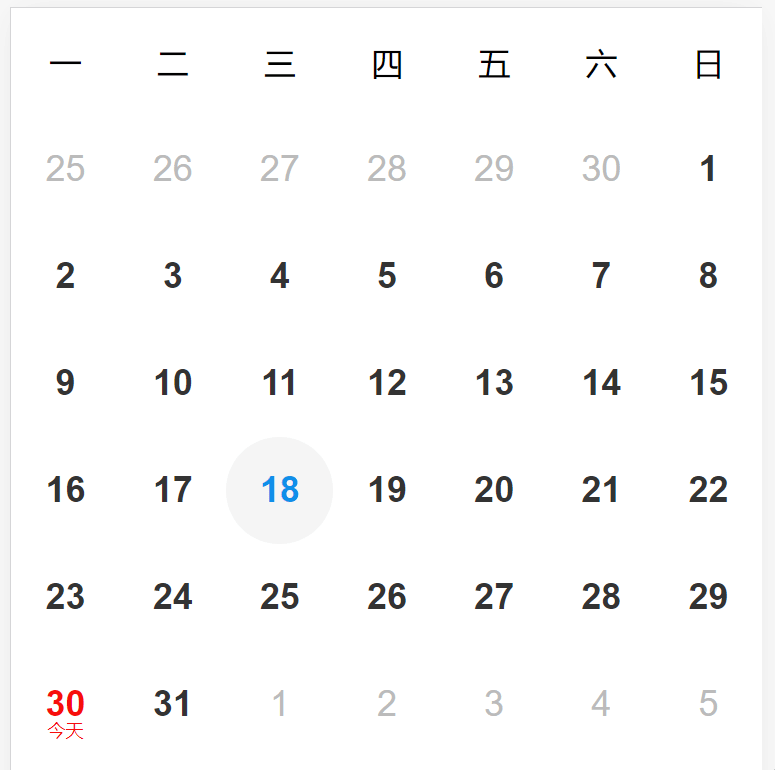
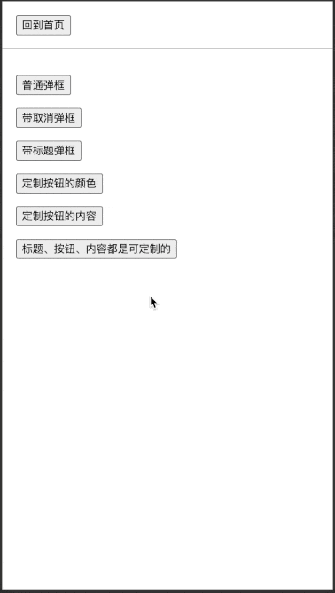
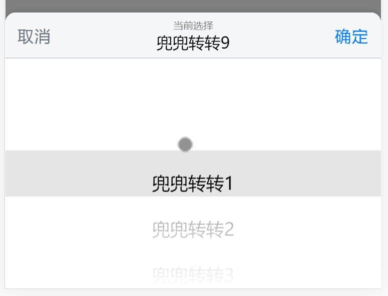
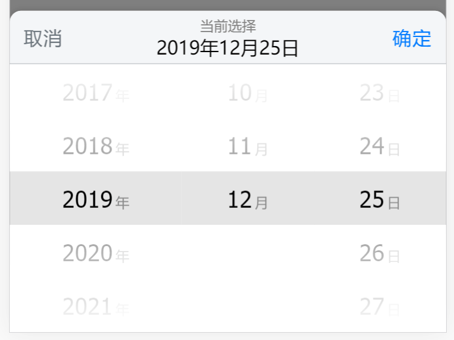
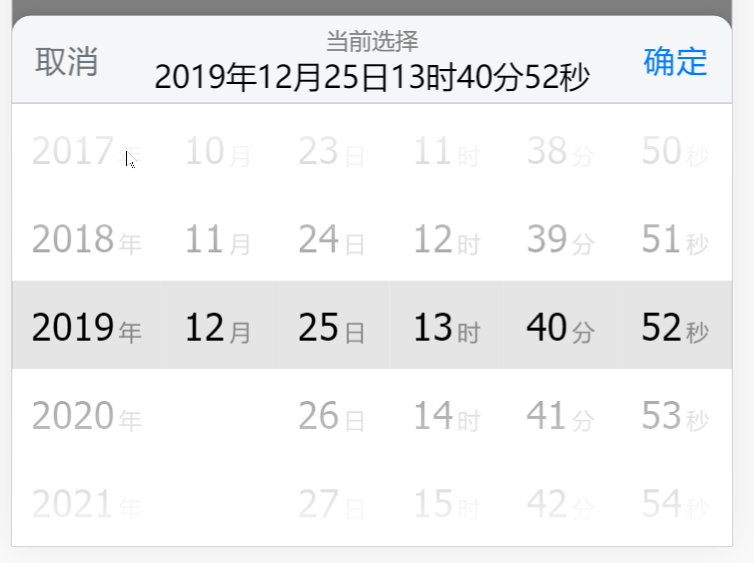

# 移动端 H5 功能集合

特色

- 基于 `React` 和 `React Hooks` 开发
- 纯基于 [`CSS-IN-JS`](https://github.com/emotion-js/emotion) 技术，零 CSS 依赖
- 完全的自适应 UI，易于使用

# TODO 列表

- [ ] 抽奖轮盘
- [ ] 图片编辑器
- [ ] 级联选择器（→ 当前正在实现 ）

# 预览（非全部功能）

  
  
  
  
  
  
  
  
  
  
  
  
  
  

