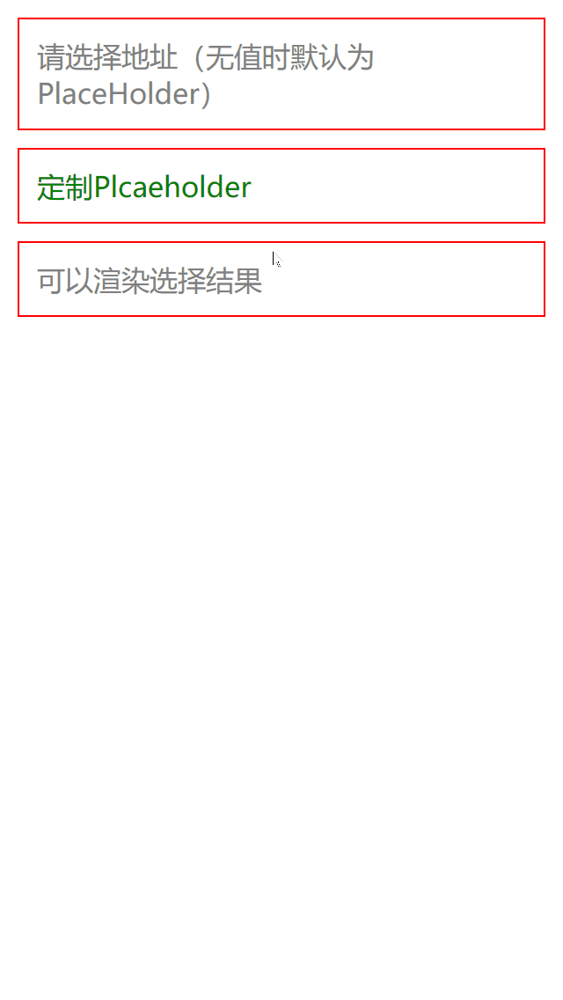

# 移动端 H5 功能集合

服务于移动端H5业务研发中的各种痛点（**自研有难度且耗时，缺乏简单易用的第三方**）功能集合：

- 基于 `React` 和 `React Hooks` 开发
- 基于 [`CSS-IN-JS`](https://github.com/emotion-js/emotion) 技术，零样式文件依赖
- 完全的自适应 UI，易于使用

> 项目采用`^TypeScript V3.7.3`开发，自带声明文件，在基于`TypeScript`的项目中引用无需额外声明！

### ❗❗❗ 关于文档和测试 ❗❗❗

文档和单元测试未完成！目前已经完成部分UI测试，部分示例代码位于`examples`目录下

# 使用

每次新功能完成都会推送到NPM仓库，`packages`目录下的每一个目录都是一个包后缀，本仓库的所有包都是组织在`@clxx`的作用域中，如想使用`ImagePicker`组件，请采用如下步骤：

## 1、第一步，安装对应包

```
yarn add @clxx/image-picker
```

或

```
npm install @clxx/image-picker
```

## 2、第二步，在项目中引用

```ts
// 导入对应包
import { ImagePicker } from "@clxx/image-picker"; 

// 图片选择器是自带UI的，参考下面的GIF预览
<ImagePicker
  column={4}
  // showPickedThumb={false}
  multiple
  onChange={(list: any) => {
    console.log(list);
  }}
/>
```


# 功能列表

<p>✅ <a href="./packages/adaptive">页面自适应组件</a></p>
<p>✅ <a href="./packages/alert">可取代系统默认的可定制alert</a></p>
<p>✅ <a href="./packages/calendar">日历</a></p>
<p>✅ <a href="./packages/cascade-picker">级联选择器</a></p>
<p>✅ <a href="./packages/clickable">可点击容器</a></p>
<p>✅ <a href="./packages/countdown">倒计时</a></p>
<p>✅ <a href="./packages/datetime-picker">日期时间选择器</a></p>
<p>✅ <a href="./packages/dialog">自带多种动画的dialog弹框容器</a></p>
<p>✅ <a href="./packages/image-picker">带旋转矫正功能的图片选择器</a></p>
<p>✅ <a href="./packages/layout">常用布局组件</a></p>
<p>✅ <a href="./packages/lazy-image">图片懒加载容器</a></p>
<p>✅ <a href="./packages/loading">纯CSS加载菊花效果</a></p>
<p>✅ <a href="./packages/picker">可取代系统默认的select选择器</a></p>
<p>✅ <a href="./packages/rolling-notice">冒泡效果的滚动公告</a></p>
<p>✅ <a href="./packages/toast">类原生Toast轻提示</a></p>
<p>✅ <a href="./packages/swiper">swiper的组件化封装</a></p>
<p>✅ <a href="./packages/waterfall">瀑布流布局效果</a></p>

<p>⚪ <a href="./packages/image-editor">移动端图片编辑器</a></p>
<p>⚪ <a href="./packages/loadmore-list">滚动容器</a></p>
<p>⚪ <a href="./packages/lottery">抽奖罗盘</a></p>
<p>⚪ <a href="./packages/scroll-view">可防穿透的滚动容器</a></p>


# 以下是部分已完成功能的GIF预览

<p>
  
  
  
  
  
  
  
  
  
  
  
  
  
  
  
</p>
