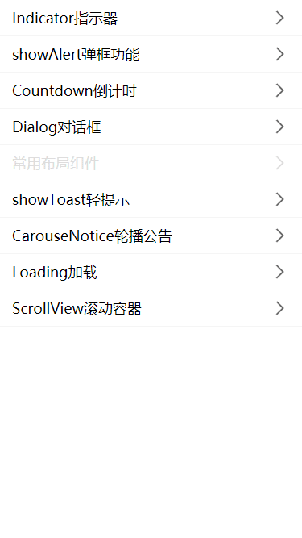

# React-based H5 features and component libraries

Collection of common functions and components

<p>
  
</p>

# Features

- Based on `react hooks` and `CSS IN JS` 
- No css file dependencies
- Adopt `vw` unit, adaptive mobile UI

> Tested version of typescript: `v4.1.3`


# Examples

`examples` are created using [create react app](https://create-react-app.dev/) and most of the features are available in demos


# Install

```
yarn add clxx
```

或

```
npm install clxx
```

# Usage

// Display a popup box that can replace the system window.alert

```ts
import { showAlert } from "clxx"; 
showAlert('Pop up box test');
```


# Implemented functions

<p>✅ <a href="./examples/src/alert">Display a pop-up box right in the middle of the screen</a></p>
<p>✅ <a href="./examples/src/carouse-notice">Rotation Announcement</a></p>
<p>✅ <a href="./examples/src/countdown">Countdown</a></p>
<p>✅ <a href="./examples/src/dialog">General dialog box</a></p>
<p>✅ <a href="./examples/src/indicator">Indicator Indicator</a></p>
<p>✅ <a href="./examples/src/loading">Universal Loading</a></p>
<p>✅ <a href="./examples/src/scrollview">ScrollView scrolling container</a></p>
<p>✅ <a href="./examples/src/showToast">showToast Light Tip</a></p>
<p>...</p>
