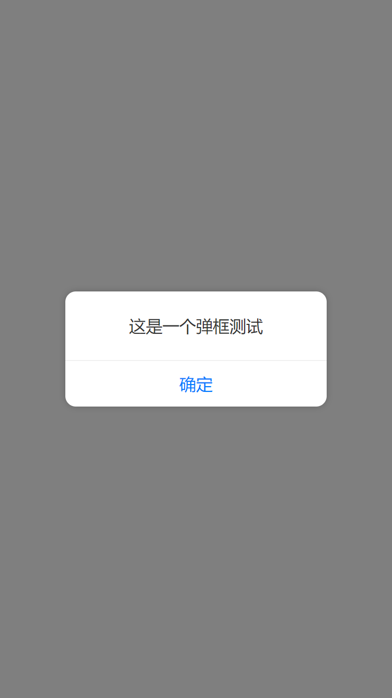
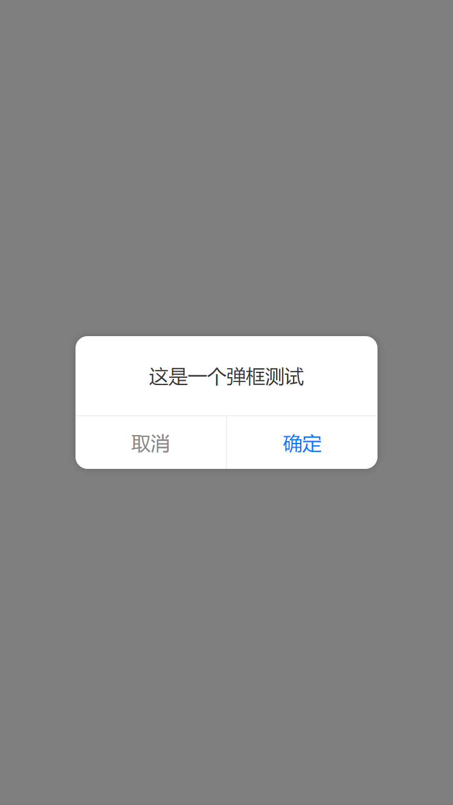

# cl-utils

日常开发常用功能集。安装：

```
npm install cl-utils
```


- 2019/8/22：移除了SCSS依赖，样式完全由CSS-IN—JS方案实现

### 全功能引入

```javascript
// 引入入口文件
import * as clUtils from "cl-utils"
```

> 目前功能集中关于组件的部分全部都是基于 `React` 框架

# Loading 组件

### 单独引入

```javascript
// 引入库
import Loading, {
  HelixComponent, 
  WaveComponent
} from "cl-utils/Loading";
```


纯CSS加载，目前包含三种预设加载效果：

- 菊花齿轮效果 `helix`
- 波浪形态效果 `wave`

<p>
  
  
</p>


```javascript
// 新建一个Loading，默认的效果是 wave
const loading = new Loading();
// 销毁上一步创建的Loading
loading.destroy();

// 可以直接传入字符串参数，在动画下方添加一个文字提示
const loading = new Loading("正在加载");

// 可以用一个配置对象参数来创建加载效果
const loading = new Loading({
  type: "wave", // 效果类型
  color: "#fff", // 加载效果元素的颜色
  hint: "正在加载", // 提示文案
});

// 当用配置对象创建加载效果时，提示内容可以是一个React组件
const loading = new Loading({
  type: "wave", // 效果类型
  color: "#fff", // 加载效果元素的颜色
  hint: <p>一个React组件</p>, // 提示文案
});
```

大部分情况下，用上述代码中的示例就可以完成工作了。有时候需要一些高级定制，如把加载动画置入一个按钮中。`Loading` 组件对外输出三个React子组件 `HelixComponent`、`WaveComponent` 和 `DottedComponent`：

```javascript
// 三个组件都接受唯一属性 color，可以是任意合法CSS颜色值 
ReactDOM.render(
  <div>
    <HelixLoading color="#000" />
    <WaveLoading color="#000" />
  </div>,
  document.getElementById("root")
);
```


# Alert 组件

可以取代原生 `alert` 的React组件

### 单独引入

```javascript
// 引入库
import alert, { AlertComponent } from "cl-utils/Alert";
```

<p>
  
  
</p>

弹框组件也是支持定制的：

```javascript
// 最简单的使用方法，跟原生alert一样
alert("这是一个弹框测试");

// 也可以通过传递配置对象参数进行复杂配置
alert({
  content: string | ReactElement; // 字符串或React组件；必选
  showMask?: boolean; // 是否显示半透明背景，默认显示；可选
  showCancel?: boolean; // 显示显示取消按钮, 默认不显示；可选
  cancelText?: string; // 取消按钮文案，默认为“取消”；可选
  confirmText?: string; // 确定按钮文案，默认为“确定”；可选
  onConfirm?: () => {}; // 点击确定按钮回调函数；可选
  onCancel?: () => {}; // 点击取消按钮回调函数；可选
  onHide?: () => {}; // 组件完全消失之后回调函数；可选
});
```

尤其要注意的是，当通过配置对象创建弹框时，`content`选项可以是一个React组件元素，这样就可以对显示内容的UI进行任意定制：

```javascript
// 显示内容为复杂React组件
alert({
  content: (
    <div>
      {/* 这里可以是任意复杂的内容 */}
    </div>
  )
});
```

# Toast 组件

类似原生功能的 `Toast` 组件

### 单独引入

```javascript
// 引入库
import Toast, { ToastComponent } from "cl-utils/Alert";
```

<p>
  
</p>


```javascript
// 最简单的用法
new Toast("这是一个测试");

// 带复杂配置的用法
new Toast({
  content: string | ReactElement; // toast显示的内容，字符串或React组件；必选 
  duration?: number; // toast持续时间，默认为3000毫秒，注意单位为毫秒；可选
  position?: string; // toast显示位置，默认为屏幕正中间，也可以为顶部和底部。三个可选值分别为: top | middle | bottom
});
```

# ajax 请求

提供了一个基于 `axios` 的封装，基于现有常用业务逻辑：

### 单独引入
```javascript
import ajax, { get, post } from "cl-utils/ajax";
```

```javascript
ajax({
  loading?: RequestLoadingOption | boolean; //显示loading动画
  httpCache?: boolean; // 启用http缓存
  transmitParam?: boolean; // 透传URL参数
  transmitHashParam?: boolean; // 透传hash参数
});
```


# 页面自适应

基于CSS单位 `rem`

### 单独引入
```javascript
import rem from "cl-utils/rem";
```

采用rem做自适应的时候，需要设计师提供设计尺寸，这里采用的度量标准是设计尺寸的宽度，一种方式是在`html`根元素上添加数据属性`data-dw`：

```html
// 第一步：HTML文件根元素设置设计尺寸(宽度)
<html data-dw="750">
  <!--省略文档内容-->
</html>

// 第二步：在JS中调用rem函数
rem();
```


其他使用方式：

```javascript
// 这种方式最简单，直接将设计尺寸作为参数传入
rem(750);

// rem也接受简单的配置参数
rem({
  criticalWidth: 576, // 移动和非移动临界点，默认576
  designWidth: 750 // 设计尺寸，默认750px。如果调用rem时没有参数，那么设计尺寸默认被当做750
});
```

# Ticker 

基于浏览器帧频的滴答器

```javascript
import Ticker from "cl-utils/ticker";
// 初始化Ticker
const ticker = new Ticker();

// 任务为函数类型
// 添加任务task1
ticker.add(task1);
// 添加任务task2  
ticker.add(task2);
// 删除任务task1
ticker.remove(task1);
// 销毁ticker
ticker.destroy();
```

任务根据 `add` 添加的先后顺序执行，默认执行任务间隔跟浏览器帧频保持一致，因而本功能适用于做动画效果。构造函数也接受参数

```javascript
// 构造函数目前接受一个参数，代表执行间隔，单位毫秒
// 下面构造函数创建了一个定时器，每隔2秒会自动执行一次任务列表
const ticker = new Ticker(2000);
```
