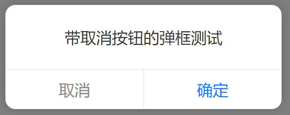
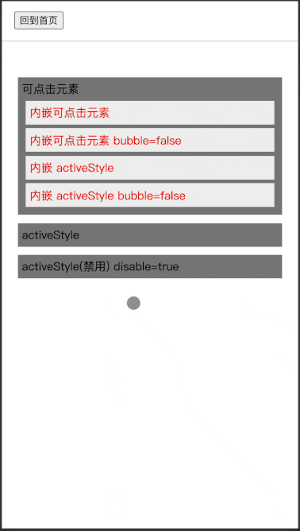
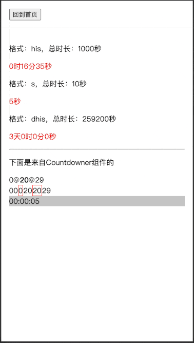
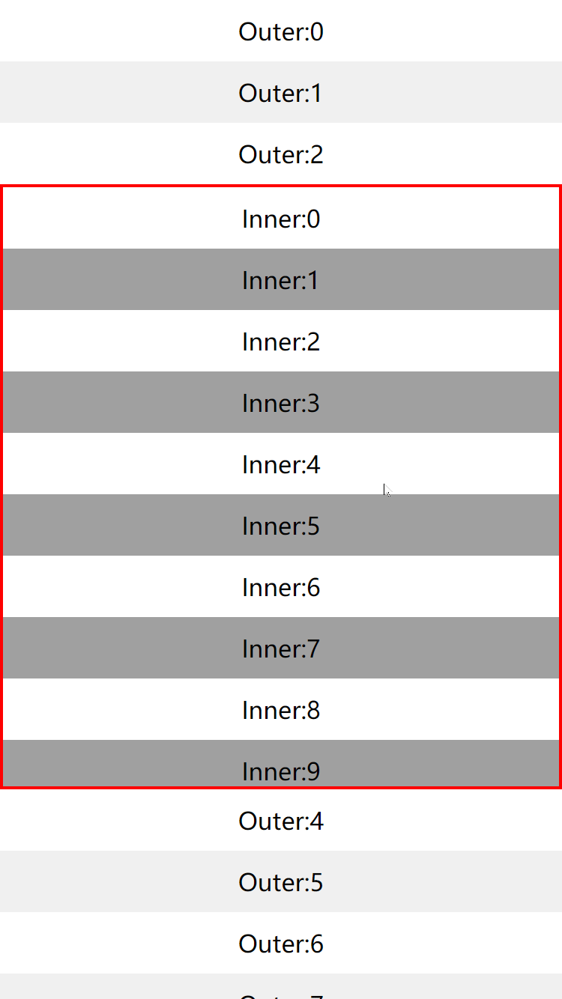

# cl-utils

> **新项目：急需队友贡献测试代码，求参与...**

一个**非主流但绝对实用**的库，**零 CSS 依赖**。涉及 UI 的逻辑大部分依赖于`React`，但使用时**不完全需要使用`jsx`组件化技术**。主要针对移动端 H5 页面，对 PC 端的 UI 同样做了兼容处理。

本仓库十分不同于常规的类似`antd`之类的组件库，常规库做的是提供一整套构建UI的基础，如按钮、排版、布局等，本仓库主要提供非主流的UI或功能实现


这里面一定有你日常开发中所需要的功能，**找不到现成方案？自己写成本太高？** 那就看看这里的实现吧

# TODO列表

项目还很新，但已经有了不少实用功能，欢迎[提交新的`TODO`列表项](https://github.com/joye61/cl-utils/issues/new)，尽力打造成一个与众不同的UI库：

- [ ] 日历宫格视图
- [ ] 瀑布流布局
- [ ] 点击展开菜单
- [ ] 通讯录字母索引效果
- [ ] 抽奖轮盘
- [ ] 图片编辑器
- [ ] 图片预览
- [ ] 点击回到顶部
- [ ] 内容滚动时索引跟随效果
- [ ] ...


# 功能预览

- [点赞特效](./src/Likeit/README.md)

  <p>
    
  </p>

- [可定制弹框](./src/Alert/README.md)

  <p>
    
  </p>

- [弹幕效果](./src/BulletScreen/README.md)

  <p>
    
  </p>

- [可响应元素](./src/Clickable/README.md)

  <p>
    
  </p>

- [倒计时](./src/CountDown/README.md)

  <p>
    
  </p>

- [纯JS加载](./src/Loading/README.md)

  <p>
    
    
  </p>


- [滚动公告](./src/RollingNotice/README.md)

  <p>
    
  </p>

- [防穿透滚动](./src/ScrollView/README.md)

  <p>
    
  </p>

- [可定制Toast](./src/Toast/README.md)

  <p>
    
  </p>

- [自适应组件](./src/Normalize/README.md)

## 安装

```
npm install cl-utils
```

或

```
yarn add cl-utils
```

# ajax

```js
// 引入
import { ajax } from "cl-utils";
```

基于 [`axios`](https://github.com/axios/axios) 进行扩展，除了支持 `axios(config)` 的全部配置，还支持部分扩展参数：

```typescript
interface RequestLoadingOption extends LoadingOption<any> {
  // loading动画最小展示时长，默认1000ms
  minExistTime?: number;
}
interface RequestOption extends AxiosRequestConfig {
  // 是否展示loading动画，可以传递布尔值，也可以传递loading配置参数
  // LoadingOption 的参数选项参考Loading组件，默认: false
  loading?: RequestLoadingOption | boolean;
  // 是否在url参数后添加当前时间，禁用浏览器缓存。默认: false
  disableHttpCache?: boolean;
  // 将当前页面的URL参数透传到所有的Http请求中去
  transmitParam?: boolean;
  // 当当前页面hash的参数透传到所有的http请求中去
  transmitHashParam?: boolean;
}
```

示例：

```js
// 引入
import { is } from "cl-utils";
```

```javascript
// 1、显示默认loading动画
ajax({
  url: "https://example.com",
  loading: true,
  httpCache: true
});
// 2、配置loading动画
ajax({
  url: "https://example.com",
  loading: {
    minExistTime: 500, // 单位毫秒
    type: "helix" // 菊花loading
  },
  httpCache: true
});
```

# is

数据类型、环境等判断：

```typescript
declare const is: {
  android(): boolean;
  ios(): boolean;
  weixin(): boolean;
  QQ(): boolean;
  iphoneX(): boolean;
  touchable(): boolean;
  boolean: (value?: any) => value is boolean;
  element: (value?: any) => boolean;
  empty: (value?: any) => boolean;
  deepEqual: (value: any, other: any) => boolean;
  error: (value: any) => value is Error;
  function: (value: any) => value is (...args: any[]) => any;
  number: (value?: any) => value is number;
  plainObject: (value?: any) => boolean;
  string: (value?: any) => value is string;
  symbol: (value: any) => boolean;
  undefined: (value: any) => value is undefined;
  null: (value: any) => value is null;
};
```

# Ticker

```js
// 引入
import { Ticker } from "cl-utils";
```

基于 `requestAnimationFrame` 的简单滴答器，可以取代浏览器自带定时器

```ts
// Ticker 构造函数接受4个参数
/**
 * 单位都为毫秒
 * @param task 可以传递一个或者多个任务（任务列表）
 * @param interval 执行间隔，默认为0，代表以requestAnimationFrame的帧频执行
 * @param repeat 任务重复次数，默认为无限执行
 * @param delay 任务开始执行时的延迟时间，默认立即执行
 */
new Ticker(
  task: Task | Array<Task>,
  private interval: number = 0,
  private repeat: number = 0,
  private delay: number = 0
);
```

基于以上签名，Ticker可以取代大部分功能

```js
// 取代 setInterval()
new Ticker(()=>{}, 1000);
// 相当于
setInterval(()=>{}, 1000);

// 取代 setTimeout()
new Ticker(()=>{}, 5000, 1);
// 相当于
setTimeout(()=>{}, 5000);

// 只有一个参数相当于不断执行的requestAnimationFrame
new Ticker(()=>{
  // logic here
});
// 相当于
const frame = ()=>{
  requestAnimationFrame(frame);
  // logic here
}
requestAnimationFrame(frame);
```
